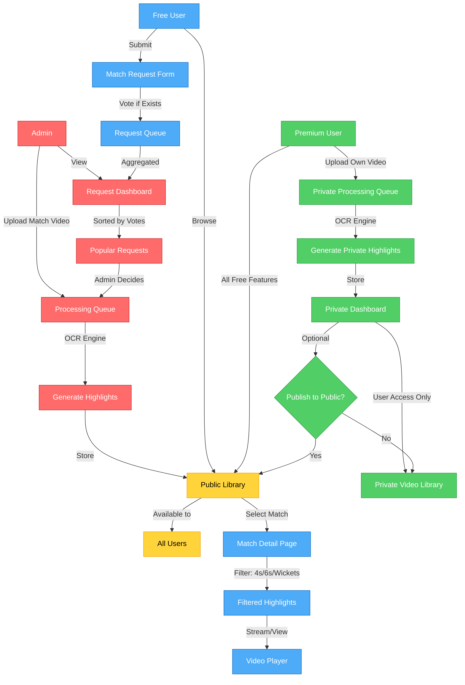
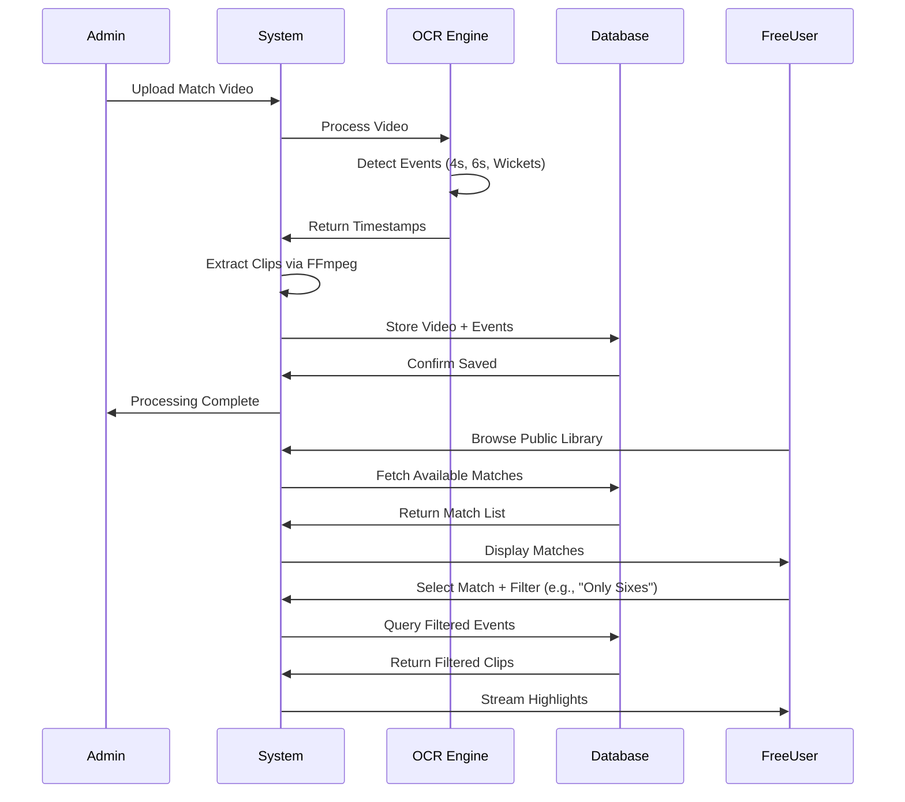
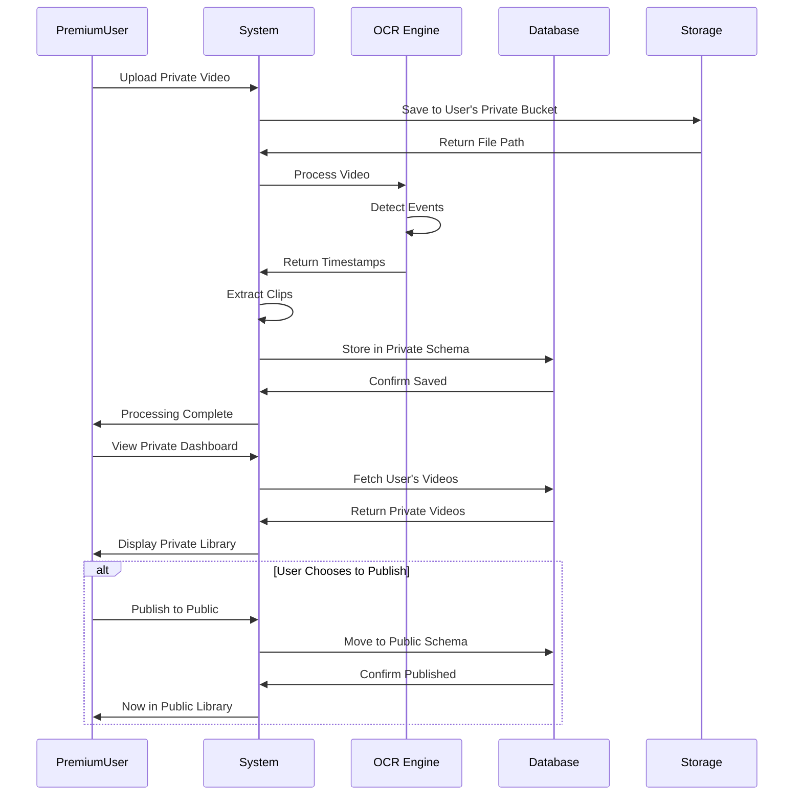
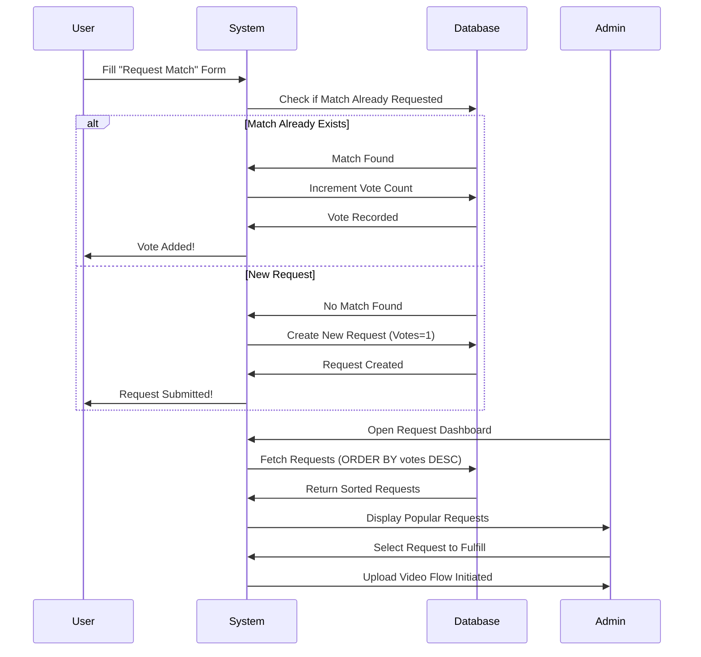
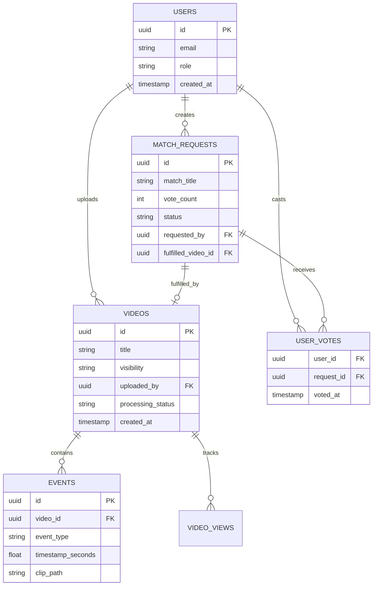
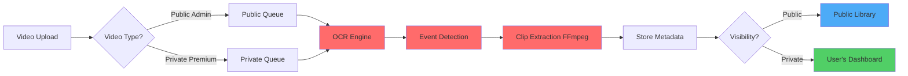
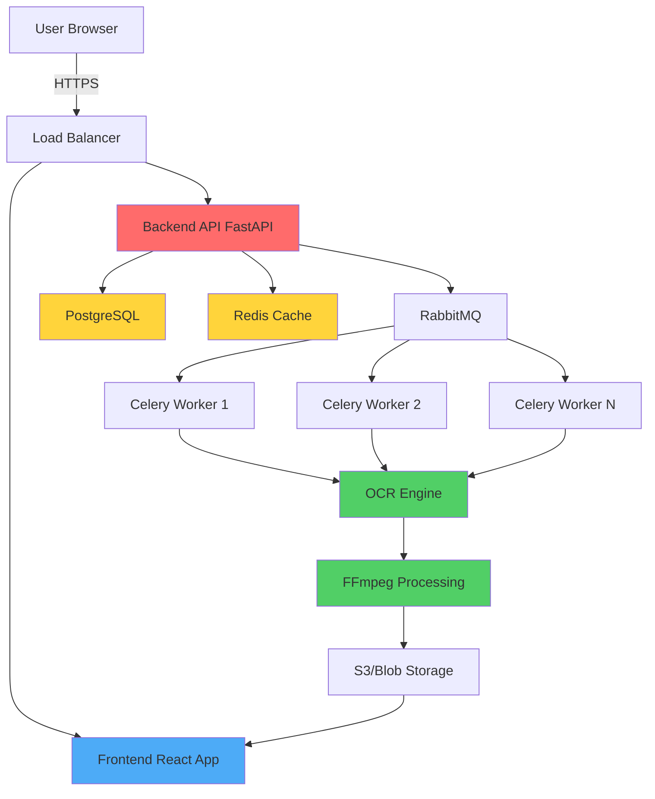

# Cricket Highlight Platform - System Architecture & UX Design

## Overview
A SaaS platform that provides automated cricket highlight generation with a clear separation between **Public Content** (free tier) and **Private On-Demand Generation** (premium tier).

---

## 1. User Roles & Capabilities

### Role Definitions

| Role | Description | Key Capability |
|------|-------------|----------------|
| **Admin** | Platform owner | Upload popular matches to public library |
| **Free User** | Consumer of public content | Browse, filter, request matches |
| **Premium User** | Pro user with private tools | Upload own videos, generate private highlights |

---

## 2. User Flow Architecture



---

## 3. Feature Access Matrix

| Feature | Admin | Free User | Premium User |
|---------|:-----:|:---------:|:------------:|
| **Browse Public Library** | ✅ | ✅ | ✅ |
| **Filter Highlights** (4s/6s/Wickets) | ✅ | ✅ | ✅ |
| **Stream/Download Public Highlights** | ✅ | ✅ (Stream Only) | ✅ (Stream + Download) |
| **Request Match** | ❌ | ✅ (Vote Only) | ✅ (Vote Only) |
| **Upload Video** | ✅ (To Public) | ❌ | ✅ (To Private) |
| **Auto-Generate Highlights** | ✅ | ❌ | ✅ |
| **Private Dashboard** | ❌ | ❌ | ✅ |
| **Publish Private to Public** | ❌ | ❌ | ✅ (Optional) |
| **View Request Dashboard** | ✅ | ❌ | ❌ |
| **Manage Public Library** | ✅ | ❌ | ❌ |
| **Analytics Dashboard** | ✅ (Full) | ❌ | ✅ (Own Videos) |

---

## 4. Detailed User Flows

### 4.1 Public Library Flow (Free Tier)



### 4.2 On-Demand Flow (Premium Tier)



### 4.3 Request System Flow



---

## 5. Database Schema

### 5.1 Core Tables

```sql
-- Users Table
CREATE TABLE users (
    id UUID PRIMARY KEY DEFAULT gen_random_uuid(),
    email VARCHAR(255) UNIQUE NOT NULL,
    username VARCHAR(100) UNIQUE NOT NULL,
    role VARCHAR(20) NOT NULL CHECK (role IN ('admin', 'free', 'premium')),
    password_hash VARCHAR(255) NOT NULL,
    created_at TIMESTAMP DEFAULT CURRENT_TIMESTAMP,
    updated_at TIMESTAMP DEFAULT CURRENT_TIMESTAMP
);

-- Videos Table (Unified: Public + Private)
CREATE TABLE videos (
    id UUID PRIMARY KEY DEFAULT gen_random_uuid(),
    title VARCHAR(255) NOT NULL,
    description TEXT,
    file_path VARCHAR(500) NOT NULL,
    duration_seconds INT NOT NULL,
    thumbnail_path VARCHAR(500),
    
    -- Visibility Control
    visibility VARCHAR(20) NOT NULL CHECK (visibility IN ('public', 'private')),
    uploaded_by UUID NOT NULL REFERENCES users(id) ON DELETE CASCADE,
    
    -- Processing Status
    processing_status VARCHAR(20) DEFAULT 'pending' CHECK (processing_status IN ('pending', 'processing', 'completed', 'failed')),
    processed_at TIMESTAMP,
    
    -- Metadata
    match_date DATE,
    teams VARCHAR(200),
    venue VARCHAR(200),
    
    created_at TIMESTAMP DEFAULT CURRENT_TIMESTAMP,
    updated_at TIMESTAMP DEFAULT CURRENT_TIMESTAMP,
    
    -- Index for performance
    INDEX idx_visibility (visibility),
    INDEX idx_uploaded_by (uploaded_by),
    INDEX idx_processing_status (processing_status)
);

-- Events Table (4s, 6s, Wickets)
CREATE TABLE events (
    id UUID PRIMARY KEY DEFAULT gen_random_uuid(),
    video_id UUID NOT NULL REFERENCES videos(id) ON DELETE CASCADE,
    event_type VARCHAR(20) NOT NULL CHECK (event_type IN ('FOUR', 'SIX', 'WICKET')),
    timestamp_seconds FLOAT NOT NULL,
    score_before VARCHAR(20),
    score_after VARCHAR(20),
    clip_path VARCHAR(500),
    
    created_at TIMESTAMP DEFAULT CURRENT_TIMESTAMP,
    
    INDEX idx_video_id (video_id),
    INDEX idx_event_type (event_type)
);

-- Match Requests Table (Voting System)
CREATE TABLE match_requests (
    id UUID PRIMARY KEY DEFAULT gen_random_uuid(),
    match_title VARCHAR(255) NOT NULL,
    match_date DATE,
    teams VARCHAR(200),
    venue VARCHAR(200),
    description TEXT,
    
    -- Voting & Priority
    vote_count INT DEFAULT 1,
    status VARCHAR(20) DEFAULT 'pending' CHECK (status IN ('pending', 'approved', 'completed', 'rejected')),
    
    -- Tracking
    requested_by UUID NOT NULL REFERENCES users(id) ON DELETE CASCADE,
    fulfilled_by UUID REFERENCES users(id) ON DELETE SET NULL,
    fulfilled_video_id UUID REFERENCES videos(id) ON DELETE SET NULL,
    
    created_at TIMESTAMP DEFAULT CURRENT_TIMESTAMP,
    updated_at TIMESTAMP DEFAULT CURRENT_TIMESTAMP,
    
    INDEX idx_status (status),
    INDEX idx_vote_count (vote_count DESC)
);

-- User Votes (Prevent Duplicate Voting)
CREATE TABLE user_votes (
    user_id UUID NOT NULL REFERENCES users(id) ON DELETE CASCADE,
    request_id UUID NOT NULL REFERENCES match_requests(id) ON DELETE CASCADE,
    voted_at TIMESTAMP DEFAULT CURRENT_TIMESTAMP,
    
    PRIMARY KEY (user_id, request_id)
);

-- Analytics Table (Optional: Track Video Views)
CREATE TABLE video_views (
    id UUID PRIMARY KEY DEFAULT gen_random_uuid(),
    video_id UUID NOT NULL REFERENCES videos(id) ON DELETE CASCADE,
    user_id UUID REFERENCES users(id) ON DELETE SET NULL,
    viewed_at TIMESTAMP DEFAULT CURRENT_TIMESTAMP,
    
    INDEX idx_video_id (video_id),
    INDEX idx_viewed_at (viewed_at)
);
```

### 5.2 Key Relationships



---

## 6. API Endpoint Structure

### 6.1 Public Library Endpoints (Free + Premium)

```
GET    /api/v1/videos/public              # List all public videos
GET    /api/v1/videos/public/:id           # Get video details
GET    /api/v1/videos/public/:id/events    # Get events (filterable by type)
GET    /api/v1/videos/public/:id/stream    # Stream video
```

### 6.2 Private Dashboard Endpoints (Premium Only)

```
POST   /api/v1/videos/private              # Upload private video
GET    /api/v1/videos/private              # List user's private videos
GET    /api/v1/videos/private/:id          # Get private video details
POST   /api/v1/videos/private/:id/publish  # Publish private video to public
DELETE /api/v1/videos/private/:id          # Delete private video
```

### 6.3 Request System Endpoints

```
POST   /api/v1/requests                    # Submit match request
GET    /api/v1/requests                    # List all requests (public)
POST   /api/v1/requests/:id/vote           # Vote for existing request
DELETE /api/v1/requests/:id/vote           # Remove vote
```

### 6.4 Admin Endpoints

```
GET    /api/v1/admin/requests              # Dashboard (sorted by votes)
PATCH  /api/v1/admin/requests/:id/status   # Approve/Reject request
POST   /api/v1/admin/videos/public         # Upload to public library
GET    /api/v1/admin/analytics             # Platform analytics
```

---

## 7. Processing Pipeline Architecture



---

## 8. Access Control Summary

### Free User Constraints
- ✅ **Can**: Browse, filter, stream public content
- ✅ **Can**: Request matches (vote once per request)
- ❌ **Cannot**: Upload videos
- ❌ **Cannot**: Download clips
- ❌ **Cannot**: Access premium features

### Premium User Benefits
- ✅ All Free User features
- ✅ Upload unlimited private videos
- ✅ Auto-generate highlights for private videos
- ✅ Download clips (public + private)
- ✅ Private dashboard with analytics
- ✅ Optional: Publish private videos to public

### Admin Privileges
- ✅ Upload videos directly to public library
- ✅ View request dashboard (sorted by popularity)
- ✅ Approve/reject/fulfill requests
- ✅ Manage all public content
- ✅ Platform-wide analytics

---

## 9. Future Enhancements

### Phase 2: Advanced Features
1. **Collaborative Playlists**: Users can create and share custom highlight playlists
2. **AI-Powered Summaries**: Auto-generate text commentary for each highlight
3. **Social Sharing**: One-click share to Twitter/Instagram with watermark
4. **Mobile App**: React Native app for iOS/Android
5. **Live Match Processing**: Real-time highlight generation during live streams

### Phase 3: Monetization
1. **Tiered Premium Plans**: Basic ($9/mo), Pro ($29/mo), Team ($99/mo)
2. **Credit System**: Free users get 3 requests/month, Premium unlimited
3. **White-Label**: Teams/Academies can self-host with custom branding
4. **API Access**: Developers can integrate highlight generation into their apps

---

## 10. Technical Stack Recommendation

| Component | Technology | Justification |
|-----------|-----------|---------------|
| **Frontend** | React + TypeScript + Vite | Fast, type-safe, modern DX |
| **Backend** | FastAPI (Python) | Async support, easy OCR integration |
| **Database** | PostgreSQL | ACID, JSON support, spatial queries |
| **Cache** | Redis | Session storage, request deduplication |
| **Storage** | AWS S3 / Azure Blob | Scalable video storage |
| **Queue** | Celery + RabbitMQ | Async video processing |
| **OCR** | EasyOCR + OpenCV | Existing implementation |
| **Video** | FFmpeg | Zero-copy clip extraction |
| **Auth** | JWT + OAuth2 | Secure, stateless |
| **Monitoring** | Prometheus + Grafana | Real-time metrics |

---

## 11. Deployment Architecture



---

## 12. Security Considerations

### Authentication & Authorization
- **JWT Tokens**: Short-lived access tokens (15 min), refresh tokens (7 days)
- **Role-Based Access Control (RBAC)**: Enforce at API gateway level
- **Rate Limiting**: 100 req/min for free users, 500 req/min for premium

### Video Privacy
- **Private Videos**: Signed URLs with 1-hour expiration
- **Access Logs**: Track who accesses which videos (GDPR compliance)
- **Watermarking**: Optional watermark on private videos to prevent leaks

### Data Protection
- **Encryption at Rest**: AWS S3 server-side encryption
- **Encryption in Transit**: TLS 1.3 for all API calls
- **GDPR Compliance**: User data export/deletion endpoints

---

## Summary

This architecture provides:
1. ✅ **Clear Separation**: Public vs. Private content with proper access control
2. ✅ **Automation**: OCR-based highlight generation with minimal admin intervention
3. ✅ **Scalability**: Queue-based processing can handle concurrent uploads
4. ✅ **Monetization Path**: Free → Premium upgrade with tangible value
5. ✅ **User Engagement**: Request/voting system creates community feedback loop

**Next Steps:**
1. Implement database schema in PostgreSQL
2. Build authentication system (JWT + OAuth2)
3. Create admin dashboard for request management
4. Develop Premium user upload flow
5. Integrate payment gateway (Stripe/Razorpay)
