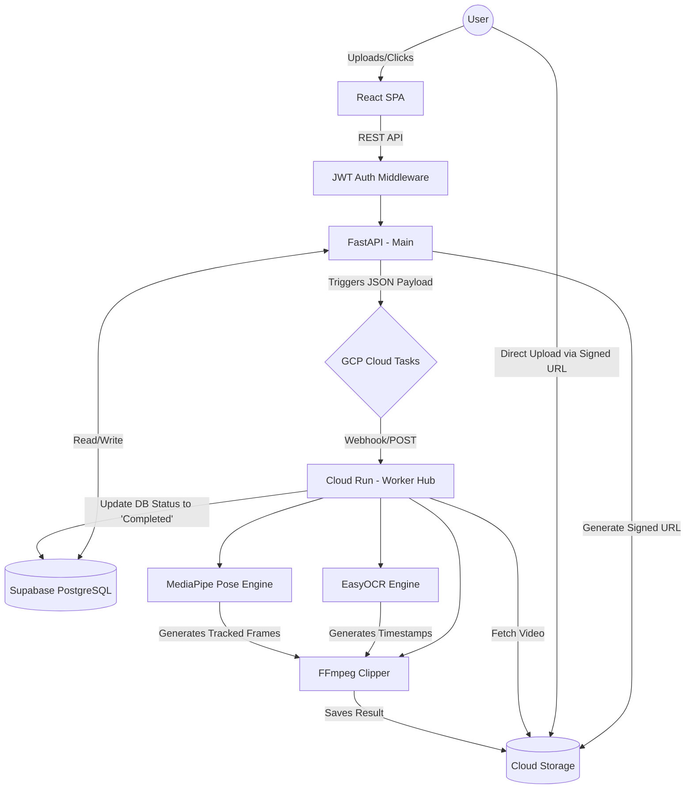

# System Architecture & Design

## 1. High-Level Architecture
The platform follows a decoupled, microservices-oriented architecture suitable for AI-heavy workloads. 
- **Frontend Layer:** A Single Page Application (SPA) built in React and Vite. Hosted on Vercel or Firebase Hosting.
- **API Gateway / Engine:** FastAPI providing RESTful endpoints, JWT Auth, and routing for user requests.
- **Asynchronous Workers:** Processing full match highlights and AI biomechanics is non-blocking. Cloud Tasks dispatches workloads to background Cloud Run worker instances.

---

## 2. Component Design & Interactions

```mermaid
graph TD
    User((User)) -->|Uploads/Clicks| Frontend[React SPA]
    Frontend -->|REST API| Auth[JWT Auth Middleware]
    Auth --> APIServer[FastAPI - Main]
    
    APIServer <-->|Read/Write| SupabaseDB[(Supabase PostgreSQL)]
    APIServer -->|Generate Signed URL| GCS[(Cloud Storage)]
    User -->|Direct Upload via Signed URL| GCS
    
    APIServer -->|Triggers JSON Payload| CloudTasks{GCP Cloud Tasks}
    CloudTasks -->|Webhook/POST| Worker[Cloud Run - Worker Hub]
    
    Worker -->|Fetch Video| GCS
    Worker --> OCREngine[EasyOCR Engine]
    Worker --> PoseEngine[MediaPipe Pose Engine]
    Worker --> FFmpeg[FFmpeg Clipper]
    
    OCREngine -->|Generates Timestamps| FFmpeg
    PoseEngine -->|Generates Tracked Frames| FFmpeg
    
    FFmpeg -->|Saves Result| GCS
    Worker -->|Update DB Status to 'Completed'| SupabaseDB
```

---

## 3. Database Schema Layout Context
**PostgreSQL** acts as the singular source of truth.
*   `Users Table:` Stores profiles, hashed passwords, and account roles (`PLAYER`, `COACH`, `ADMIN`). Subscription tier is tracked separately via the `Subscription` table and `PlanConfig` rows, not as a column on the user.
*   `Subscription Table:` Links a user to their active plan (e.g. `free`, `basic`, `platinum`, `coach_free`, `coach_starter`, `coach_pro`, `academy`) with start/expiry timestamps. Plans are fixed-duration (90/180/365 days), not recurring.
*   `PlanConfig Table:` Defines per-plan quota limits (`max_biomech_per_month`, `max_ocr_hours_per_month`, `max_submissions_per_month`, `max_players_in_dashboard`). Seeded once at startup.
*   `MonthlyUsage Table:` Tracks real-time usage counters per user per month; compared against `PlanConfig` limits by the feature gate layer.
*   `Videos Table:` Tracks uploaded file paths, status (`processing`, `failed`, `completed`), and visibility (`public`, `private`).
*   `Highlights/Events Table:` Relational pointers connecting a parent video with specific timestamp clips, tracking whether it's a '4', '6', or 'Wicket'.
*   `Submissions Table:` Enables player-to-coach video review workflows with statuses (`PENDING`, `PROCESSING`, `DRAFT_REVIEW`, `PUBLISHED`, `REJECTED`).

---

## 4. Specific AI Engine Modules
*   **OCR Match Highlights (`ocr_engine.py`):** Utilizes `yt-dlp` for ingress. Instead of analyzing every single frame, it scrubs effectively using a rolling median history queue to prevent scoreboard flickering from causing false positives.
*   **Biomechanics (`batting_engine.py`):** Loads a pre-trained `.task` model. Applies body landmarking against a coordinate grid. Automatically highlights physical outliers (e.g., incorrect elbow angle on a cover drive).
